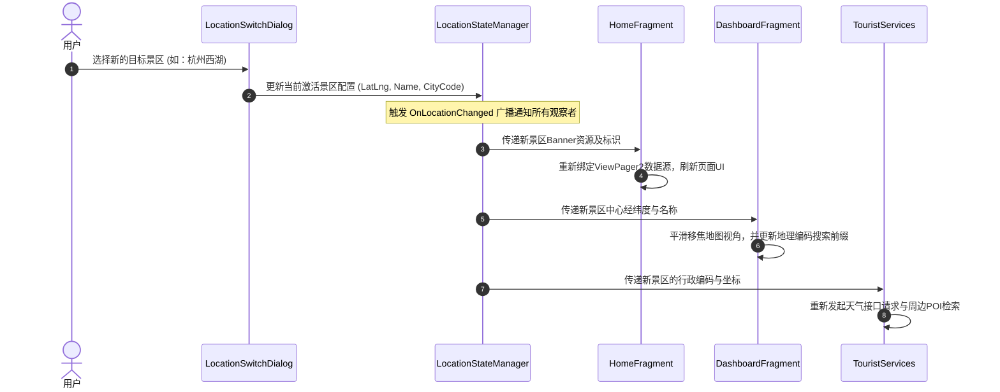

# 承德避暑山庄及通用旅游APP - 新增功能规划与开发方案

## 目录

1. [项目概述](#1-项目概述)
2. [新增功能总体规划](#2-新增功能总体规划)
3. [核心功能详细规划](#3-核心功能详细规划)
   - [3.1 通知推送功能](#31-通知推送功能)
   - [3.2 后台定位服务](#32-后台定位服务)
   - [3.3 Activity启动模式与栈管理](#33-activity启动模式与栈管理)
   - [3.4 全局动态地点切换与数据联动](#34-全局动态地点切换与数据联动)
   - [3.5 游客服务三大模块动态化重构](#35-游客服务三大模块动态化重构)
4. [系统联动架构与数据流向](#4-系统联动架构与数据流向)
5. [开发阶段划分与实施路线图](#5-开发阶段划分与实施路线图)
6. [质量验证与容灾降级规划](#6-质量验证与容灾降级规划)

---

## 1. 项目概述

本项目是一个基于Android平台的承德避暑山庄旅游APP，旨在为游客提供智能导览与便捷出行服务。为了将该APP从单一的“特定景区展示APP”升级为“通用、智能、可自适应切换的多景区导览APP”，并解决原本代码中深度硬编码与静态页面的问题，本项目将进行全面架构重构与新功能的引入。

---

## 2. 新增功能总体规划

本次迭代的核心是将硬编码的业务逻辑剥离，引入全局状态管理，并重构核心业务模块。功能规划如下表所示：

| 优先级 | 功能模块名称 | 核心规划内容描述 | 预期业务收益 |
| :--- | :--- | :--- | :--- |
| **P0** | **全局动态地点切换** | 建立全局景区配置管理器，支持在多个著名景区（如承德避暑山庄、北京颐和园、杭州西湖、泰山）间手动切换定位，一键联动更新APP所有页面数据。 | 拓展APP适用范围，实现多景区动态兼容，提升通用化程度。 |
| **P0** | **地图与搜索解耦** | 移去地图初始化坐标的硬编码，将地址搜索、路径规划等前缀从写死的景区名称改造为基于当前选择景区动态装配。 | 解决在非主景区时搜索与路径规划跑偏、无法定位的缺陷。 |
| **P0** | **后台定位服务** | 引入前台保活Service持续获取用户位置，配合地理围栏技术，在用户靠近特定景点时自动弹出导览推送。 | 提供免操作的智能“随身导游”体验。 |
| **P0** | **通知推送功能** | 设计多渠道通知体系，处理人流量超载、景区优惠活动、系统紧急公告的接收与精确分发。 | 提高景区管理安全性，加强用户互动与营销能力。 |
| **P1** | **游客服务重构** | 淘汰原有硬编码静态页面，彻底改版为：“本地生活服务”（周边餐饮/酒店）、“周边景点探索”与“实时天气与出行建议”。 | 提供高实用性的动态信息，协助游客完成吃、住、行决策。 |
| **P1** | **Activity启动优化** | 重新规划核心界面的启动模式（LaunchMode）与页面跳转逻辑，引入栈复用机制，规范页面返回路径。 | 杜绝由于重复拉起Activity导致的栈积压、白屏及内存泄漏。 |

---

## 3. 核心功能详细规划

### 3.1 通知推送功能

#### 3.1.1 场景规划
根据业务紧急程度和信息类别，将通知划分为三类：
1. **人流量预警（高优先级）**：当某区域游客数逼近最大承载量时触发，需要震动与高铃声提示。
2. **优惠活动推送（中优先级）**：门票促销、周边文创满减活动通知。
3. **系统公告（低优先级）**：景区闭园时间调整、设备维护公告。

#### 3.1.2 渠道与导航设计
* **渠道隔离**：在系统通知栏中分别建立对应的三个独立通知渠道，支持用户自主在系统设置中屏蔽特定分类。
* **深层链接（Deep Linking）**：用户点击通知栏消息后，APP须精准识别携带参数，直接跳转到对应的二级子Fragment（如人流量统计页面或票务购买页面），而不是单纯返回APP首页。

---

### 3.2 后台定位服务

#### 3.2.1 运行机制规划
* **前台服务保活**：由于系统会对后台定位进行严格限制，该定位服务必须在前台Service中运行，并在手机状态栏常驻一个“智能导览进行中”通知，防止被系统低内存杀死。
* **地理围栏计算**：定位服务定时（如每5秒）获取GPS/网络经纬度，并与数据层中当前景区的所有景点坐标进行哈希测距。
* **景点到达事件**：当检测到用户距离某个景点的半径小于50米时，立刻触发景点到达广播，唤醒通知推送类向游客展示该景点的详细图文导览。

---

### 3.3 Activity启动模式与栈管理

#### 3.3.1 页面栈行为规范
针对用户容易频繁点击跳转的界面，规划具体的任务栈模式：
* **主控制器页面 (MainActivity)**：采用 `singleTask` 模式。作为整个应用栈的根基，任何时候整个系统中仅能存在一个实例。当从深层详情页返回主页时，自动清空其上方的所有Activity。
* **票务购买页与人流量统计页**：采用 `singleTop` 模式。若用户已处在此页面，重复点击推送消息或轮播图不会拉起新实例，而是直接复用栈顶，调用新参数更新。
* **跳转标志控制**：封装页面导航器，在启动Activity时，显式配置单实例或复用标志符，严防非规范跳转。

---

### 3.4 全局动态地点切换与数据联动

#### 3.4.1 动态联动机制
APP引入以观察者模式为基础的全局位置状态机。当用户手动切换所处景区时，联动刷新链条规划如下：
1. **首页联动**：更新顶部景区的标识文本，更换对应的横幅轮播图资源。
2. **地图页联动**：平滑将地图视角移焦至新景区中心，清空旧景区标记，加载新景区的专用设施打卡标点。
3. **搜索与路径解耦**：将所有API调用的地理编码参数前缀，修改为读取当前激活景区名称，确保在西湖切换时能正常解析“西湖断桥”的经纬度。
4. **数据层重构**：`SpotData` 中的树状节点不再写死“承德避暑山庄”，而是根据切换后的景区配置，动态生成对应的景点及设施层级数据树。

---

### 3.5 游客服务三大模块动态化重构

#### 3.5.1 游客应知 ➔ 本地生活服务推荐
* **内容规划**：基于当前选定景区中心的经纬度，实时拉取周边2公里范围内的餐饮、酒店住宿及超市配套信息。
* **交互规划**：卡片式列表，显示商户名称、人均消费、距景区边界的步行距离，提供一键将该商户坐标设为地图导航终点的快捷键。

#### 3.5.2 景区概览 ➔ 周边景点探索
* **内容规划**：为自驾或多日游用户推荐当前景区周边的其他高品质旅游景点，按距离与推荐指数排序。
* **交互规划**：瀑布流卡片，提供景点星级（1-5星）和距离。点击周边景点可发起一键拼合的Prim路径规划。

#### 3.5.3 游园须知 ➔ 实时天气与出行建议
* **内容规划**：显示新选定景区所在城市的实时温度、风力、空气质量（AQI），并结合天气状况为游客生成智能旅游出行贴士。
* **决策树规划**：
  * *下雨天* ➔ 提示路滑、推荐游览室内宫殿或租用雨具。
  * *高温晴天* ➔ 提示紫外线极强、推荐注意防晒与防暑。
  * *微风阴天* ➔ 提示天气凉爽舒适、推荐全天进行室外漫步与打卡。

---

## 4. 系统联动架构与数据流向

全局地点切换后的联动时序及数据流向规划如下：

---

## 5. 开发阶段划分与实施路线图

为了确保项目开发过程的稳健推进和高质量集成，开发周期划分为五个递进阶段：

### 第1阶段：底层架构设计与状态机建立（预计：2天）
* **任务目标**：建立支持多景区的实体配置，搭建全局景区管理器与观察者广播接口，彻底实现位置状态的全局捕获。
* **交付成果**：景区配置模型、全局状态管理器类，以及全局 Application 的自适应初始化逻辑。

### 第2阶段：首页与地图解耦适配（预计：3天）
* **任务目标**：实现首页和地图页对全局位置状态机广播的响应。
* **交付成果**：
  * 首页支持动态景区Banner和标识文字更新；
  * 地图页能够随着景区切换实现视角自动缩放平滑转移，且搜索前缀能够根据所选景区自动组装；
  * 实现漂亮的 BottomSheet 风格的地点切换对话框。

### 第3阶段：三大游客服务模块动态化重构（预计：4天）
* **任务目标**：重构并替换三个传统的静态服务 Fragment，接入真实的外部 API（POI与天气）以及离线防白屏降级模块。
* **交付成果**：
  * 重新设计并实现的本地生活周边配套页面；
  * 支持一键导航关联的周边景点探索瀑布流页面；
  * 支持自适应生成登山出行小贴士的天气预报毛玻璃卡片页面。

### 第4阶段：通知机制与后台定位整合（预计：3天）
* **任务目标**：完成后台定位服务与多渠道通知推送模块的开发，并对核心Activity启动模式进行优化。
* **交付成果**：
  * 支持常驻前台的保活定位 Service，实现地理围栏及景点到达检测；
  * 支持三渠道（预警、促销、系统公告）分发的通知管理类；
  * 修改配置清单，规范核心 Activity 任务栈并封装防重复跳转逻辑。

### 第5阶段：集成联调与健壮性验证（预计：2天）
* **任务目标**：进行跨模块联调，设计离线与权限拒绝情况下的异常兼容方案，对整个软件的任务栈堆叠情况进行压力测试。
* **交付成果**：集成测试用例分析表、弱网与离线降级方案报告、最终交付版系统。

---

## 6. 质量验证与容灾降级规划

为了保障APP在各种复杂的现实户外场景（如景区弱网、定位权限被拒）中稳定运行，设计了如下的容灾降级验证方案：

### 6.1 异常情况降级策略
1. **弱网/断网容灾**：当游客在山峦区等弱网地带导致 POI 检索或天气 API 失败时，服务层需捕获超时异常，并自动读取本地 Assets 中预置的各大景区景点及生活数据，平滑降级，界面采用淡入淡出骨架图过度，绝不允许APP发生崩溃或呈现无限加载状态。
2. **定位权限拒绝**：若游客在安装或运行期间拒绝授权精确定位权限，系统自动将当前坐标回落到“当前选定景区配置的中心坐标”，并显示引导文字提示用户手动切换景区。

### 6.2 模块功能验证矩阵

| 验证场景 | 执行路径设计 | 预期正确行为标准 |
| :--- | :--- | :--- |
| **景区切换响应** | 在首页弹出对话框，由“承德避暑山庄”切换为“杭州西湖”。 | 1. 首页瞬间刷新为西湖宣传图； 2. 顶栏文字变为西湖； 3. 伴随平滑过渡动画。 |
| **地图视角与搜索** | 切换到“北京颐和园”，并在 Dashboard 搜索框输入“万寿山”。 | 1. 地图平滑自动移焦至颐和园； 2. 搜索接口自动组装请求“北京颐和园万寿山”坐标，并精准在地图上插针标记。 |
| **天气出行贴士** | 切换至“泰安泰山”，进入天气预报 Fragment。 | 1. 自动定位到泰安市天气编码； 2. 卡片显示泰山今日风力、气温； 3. 给出防寒、防滑的针对性登山建议。 |
| **后台景点到达** | 启动后台定位服务，使用虚拟定位模拟游客距离西湖“断桥”40米。 | 1. 后台Service成功触发围栏机制； 2. 手机状态栏立刻收到“到达景点：欢迎来到西湖断桥”的智能导览高优先级通知。 |
