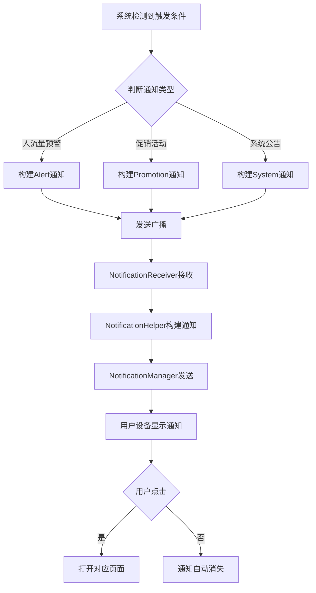
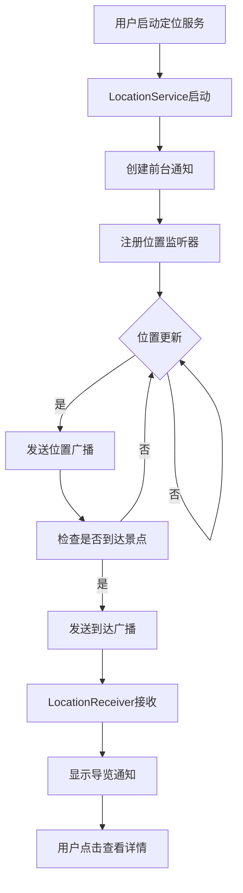
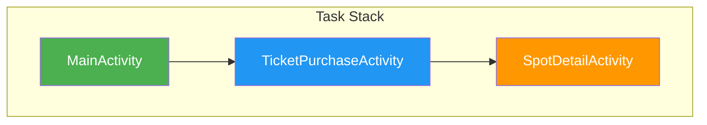

# 承德避暑山庄旅游APP - 新增功能设计实现方案

## 目录

1. [项目概述](#1-项目概述)
2. [功能优先级总览](#2-功能优先级总览)
3. [第一优先级：通知推送功能](#3-第一优先级通知推送功能)
4. [第二优先级：后台定位服务](#4-第二优先级后台定位服务)
5. [第三优先级：Activity启动模式优化](#5-第三优先级activity启动模式优化)
6. [总结与开发建议](#6-总结与开发建议)

---

## 1. 项目概述

本项目是一个基于Android平台的承德避暑山庄旅游APP，当前已实现的核心功能包括：
- 首页轮播展示
- 百度地图集成与定位
- 票务购买系统
- 人流量统计展示
- 景点推荐系统
- 个人中心

根据对课件知识点的分析，以下功能尚未实现但对APP实用性至关重要：
- **通知推送功能**（对应第04章 Android广播与通知）
- **后台定位服务**（对应第07章 Android后台服务）
- **Activity启动模式优化**（对应第02章 Activity组件与生命周期）

---

## 2. 功能优先级总览

| 优先级 | 功能名称 | 对应课件章节 | 预期收益 |
| :--- | :--- | :--- | :--- |
| **P0** | 通知推送功能 | 第04章 | 提升用户活跃度和留存率 |
| **P0** | 后台定位服务 | 第07章 | 实现位置追踪和智能导览 |
| **P1** | Activity启动模式优化 | 第02章 | 优化页面跳转体验和内存管理 |

---

## 3. 第一优先级：通知推送功能

### 3.1 功能需求分析

**功能目标**：实现APP的消息推送能力，向用户发送景点信息、活动通知、系统公告等。

**应用场景**：
| 场景 | 描述 | 触发条件 |
| :--- | :--- | :--- |
| 人流量预警 | 当某个景点人流量达到阈值时推送提醒 | 人流量数据超过设定阈值 |
| 优惠活动推送 | 推送门票优惠、促销活动信息 | 定时推送或活动开始时 |
| 行程提醒 | 提醒用户已预订的门票、导览计划 | 基于用户预订信息定时提醒 |
| 系统公告 | 推送景区公告、维护通知等 | 管理员后台发布公告 |

### 3.2 技术设计

#### 3.2.1 类结构设计

| 类名 | 职责 | 所属包 |
| :--- | :--- | :--- |
| `NotificationHelper` | 通知管理工具类，提供通知构建和发送功能 | `com.example.summer.utils` |
| `NotificationChannelManager` | 通知渠道管理，负责创建和管理通知渠道 | `com.example.summer.utils` |
| `NotificationReceiver` | 通知点击接收器，处理用户点击通知的行为 | `com.example.summer.receiver` |

#### 3.2.2 核心代码实现

**1. NotificationChannelManager.java - 通知渠道管理**

```java
package com.example.summer.utils;

import android.app.NotificationChannel;
import android.app.NotificationManager;
import android.content.Context;
import android.os.Build;

public class NotificationChannelManager {
    
    public static final String CHANNEL_ID_ALERT = "tourism_alert";
    public static final String CHANNEL_ID_PROMOTION = "tourism_promotion";
    public static final String CHANNEL_ID_SYSTEM = "tourism_system";

    public static void createNotificationChannels(Context context) {
        if (Build.VERSION.SDK_INT >= Build.VERSION_CODES.O) {
            NotificationManager notificationManager = 
                (NotificationManager) context.getSystemService(Context.NOTIFICATION_SERVICE);

            // 创建人流量预警渠道
            NotificationChannel alertChannel = new NotificationChannel(
                CHANNEL_ID_ALERT,
                "人流量预警",
                NotificationManager.IMPORTANCE_HIGH
            );
            alertChannel.setDescription("景点人流量实时预警通知");
            alertChannel.enableVibration(true);
            alertChannel.setVibrationPattern(new long[]{100, 200, 300});

            // 创建促销活动渠道
            NotificationChannel promotionChannel = new NotificationChannel(
                CHANNEL_ID_PROMOTION,
                "优惠活动",
                NotificationManager.IMPORTANCE_DEFAULT
            );
            promotionChannel.setDescription("门票优惠、促销活动通知");

            // 创建系统公告渠道
            NotificationChannel systemChannel = new NotificationChannel(
                CHANNEL_ID_SYSTEM,
                "系统公告",
                NotificationManager.IMPORTANCE_LOW
            );
            systemChannel.setDescription("景区公告、维护通知");

            // 注册所有渠道
            notificationManager.createNotificationChannels(
                java.util.Arrays.asList(alertChannel, promotionChannel, systemChannel)
            );
        }
    }
}
```

**2. NotificationHelper.java - 通知管理工具类**

```java
package com.example.summer.utils;

import android.app.Notification;
import android.app.NotificationManager;
import android.app.PendingIntent;
import android.content.Context;
import android.content.Intent;
import android.os.Build;

import androidx.core.app.NotificationCompat;

import com.example.summer.R;
import com.example.summer.ui.main.MainActivity;

public class NotificationHelper {

    /**
     * 显示人流量预警通知
     */
    public static void showCrowdAlertNotification(Context context, String spotName, int count) {
        Intent intent = new Intent(context, MainActivity.class);
        intent.putExtra("target_fragment", "crowd");
        intent.putExtra("spot_name", spotName);
        PendingIntent pendingIntent = PendingIntent.getActivity(
            context, 0, intent, 
            Build.VERSION.SDK_INT >= Build.VERSION_CODES.M ? 
                PendingIntent.FLAG_IMMUTABLE : PendingIntent.FLAG_UPDATE_CURRENT
        );

        Notification notification = new NotificationCompat.Builder(context, 
            NotificationChannelManager.CHANNEL_ID_ALERT)
            .setContentTitle("人流量预警")
            .setContentText(String.format("%s 当前人流量较大，建议错峰游览", spotName))
            .setSmallIcon(R.drawable.ic_notification_alert)
            .setLargeIcon(Utils.getBitmapFromVectorDrawable(context, R.drawable.ic_crowd))
            .setPriority(NotificationCompat.PRIORITY_HIGH)
            .setContentIntent(pendingIntent)
            .setAutoCancel(true)
            .setVibrate(new long[]{100, 200, 300})
            .build();

        NotificationManager manager = (NotificationManager) 
            context.getSystemService(Context.NOTIFICATION_SERVICE);
        manager.notify(getNotificationId("crowd_" + spotName), notification);
    }

    /**
     * 显示促销活动通知
     */
    public static void showPromotionNotification(Context context, String title, String content) {
        Intent intent = new Intent(context, MainActivity.class);
        intent.putExtra("target_fragment", "ticket");
        PendingIntent pendingIntent = PendingIntent.getActivity(
            context, 0, intent, 
            Build.VERSION.SDK_INT >= Build.VERSION_CODES.M ? 
                PendingIntent.FLAG_IMMUTABLE : PendingIntent.FLAG_UPDATE_CURRENT
        );

        Notification notification = new NotificationCompat.Builder(context, 
            NotificationChannelManager.CHANNEL_ID_PROMOTION)
            .setContentTitle(title)
            .setContentText(content)
            .setSmallIcon(R.drawable.ic_notification_promotion)
            .setPriority(NotificationCompat.PRIORITY_DEFAULT)
            .setContentIntent(pendingIntent)
            .setAutoCancel(true)
            .build();

        NotificationManager manager = (NotificationManager) 
            context.getSystemService(Context.NOTIFICATION_SERVICE);
        manager.notify(getNotificationId("promotion"), notification);
    }

    /**
     * 显示系统公告通知
     */
    public static void showSystemNotification(Context context, String title, String content) {
        Intent intent = new Intent(context, MainActivity.class);
        intent.putExtra("target_fragment", "notice");
        PendingIntent pendingIntent = PendingIntent.getActivity(
            context, 0, intent, 
            Build.VERSION.SDK_INT >= Build.VERSION_CODES.M ? 
                PendingIntent.FLAG_IMMUTABLE : PendingIntent.FLAG_UPDATE_CURRENT
        );

        Notification notification = new NotificationCompat.Builder(context, 
            NotificationChannelManager.CHANNEL_ID_SYSTEM)
            .setContentTitle(title)
            .setContentText(content)
            .setSmallIcon(R.drawable.ic_notification_system)
            .setPriority(NotificationCompat.PRIORITY_LOW)
            .setContentIntent(pendingIntent)
            .setAutoCancel(true)
            .build();

        NotificationManager manager = (NotificationManager) 
            context.getSystemService(Context.NOTIFICATION_SERVICE);
        manager.notify(getNotificationId("system"), notification);
    }

    /**
     * 生成唯一通知ID
     */
    private static int getNotificationId(String key) {
        return Math.abs(key.hashCode());
    }
}
```

**3. NotificationReceiver.java - 通知广播接收器**

```java
package com.example.summer.receiver;

import android.content.BroadcastReceiver;
import android.content.Context;
import android.content.Intent;

import com.example.summer.utils.NotificationHelper;

public class NotificationReceiver extends BroadcastReceiver {

    public static final String ACTION_SHOW_ALERT = "com.example.summer.action.SHOW_ALERT";
    public static final String ACTION_SHOW_PROMOTION = "com.example.summer.action.SHOW_PROMOTION";
    public static final String ACTION_SHOW_SYSTEM = "com.example.summer.action.SHOW_SYSTEM";

    public static final String EXTRA_TITLE = "title";
    public static final String EXTRA_CONTENT = "content";
    public static final String EXTRA_SPOT_NAME = "spot_name";
    public static final String EXTRA_COUNT = "count";

    @Override
    public void onReceive(Context context, Intent intent) {
        String action = intent.getAction();
        
        if (ACTION_SHOW_ALERT.equals(action)) {
            String spotName = intent.getStringExtra(EXTRA_SPOT_NAME);
            int count = intent.getIntExtra(EXTRA_COUNT, 0);
            NotificationHelper.showCrowdAlertNotification(context, spotName, count);
        } else if (ACTION_SHOW_PROMOTION.equals(action)) {
            String title = intent.getStringExtra(EXTRA_TITLE);
            String content = intent.getStringExtra(EXTRA_CONTENT);
            NotificationHelper.showPromotionNotification(context, title, content);
        } else if (ACTION_SHOW_SYSTEM.equals(action)) {
            String title = intent.getStringExtra(EXTRA_TITLE);
            String content = intent.getStringExtra(EXTRA_CONTENT);
            NotificationHelper.showSystemNotification(context, title, content);
        }
    }
}
```

#### 3.2.3 配置文件修改

**AndroidManifest.xml 添加广播接收器注册**：

```xml
<receiver
    android:name=".receiver.NotificationReceiver"
    android:exported="false">
    <intent-filter>
        <action android:name="com.example.summer.action.SHOW_ALERT" />
        <action android:name="com.example.summer.action.SHOW_PROMOTION" />
        <action android:name="com.example.summer.action.SHOW_SYSTEM" />
    </intent-filter>
</receiver>
```

#### 3.2.4 初始化调用

在 `Application` 类或主 `Activity` 的 `onCreate` 方法中初始化：

```java
// 初始化通知渠道（Android O+）
NotificationChannelManager.createNotificationChannels(this);
```

### 3.3 业务流程



### 3.4 测试用例

| 测试场景 | 测试步骤 | 预期结果 |
| :--- | :--- | :--- |
| 人流量预警通知 | 调用showCrowdAlertNotification | 通知栏显示预警消息，点击跳转到人流量页面 |
| 促销活动通知 | 调用showPromotionNotification | 通知栏显示促销消息，点击跳转到购票页面 |
| 系统公告通知 | 调用showSystemNotification | 通知栏显示公告消息，点击跳转到公告页面 |
| 渠道创建 | 首次启动APP | 三个通知渠道成功创建 |

---

## 4. 第二优先级：后台定位服务

### 4.1 功能需求分析

**功能目标**：实现后台持续定位能力，支持位置追踪、到达景点自动推送导览信息等功能。

**应用场景**：
| 场景 | 描述 | 技术需求 |
| :--- | :--- | :--- |
| 实时位置追踪 | 在后台持续获取用户位置 | 后台Service + 位置监听 |
| 景点到达提醒 | 当用户到达某个景点时自动推送导览信息 | 地理围栏/距离判断 |
| 位置分享 | 分享当前位置给好友 | 位置数据获取 |
| 轨迹记录 | 记录用户游览路线 | 位置历史存储 |

### 4.2 技术设计

#### 4.2.1 类结构设计

| 类名 | 职责 | 所属包 |
| :--- | :--- | :--- |
| `LocationService` | 后台定位服务，负责位置获取和广播 | `com.example.summer.service` |
| `LocationManagerHelper` | 位置管理工具类，封装定位逻辑 | `com.example.summer.utils` |
| `LocationReceiver` | 位置更新广播接收器 | `com.example.summer.receiver` |
| `GeofenceManager` | 地理围栏管理，检测用户是否到达景点 | `com.example.summer.utils` |

#### 4.2.2 核心代码实现

**1. LocationService.java - 后台定位服务**

```java
package com.example.summer.service;

import android.app.Notification;
import android.app.NotificationChannel;
import android.app.NotificationManager;
import android.app.Service;
import android.content.Context;
import android.content.Intent;
import android.content.pm.PackageManager;
import android.location.Location;
import android.location.LocationListener;
import android.location.LocationManager;
import android.os.Binder;
import android.os.Build;
import android.os.Bundle;
import android.os.IBinder;

import androidx.core.app.ActivityCompat;
import androidx.core.app.NotificationCompat;

import com.example.summer.R;
import com.example.summer.utils.LocationManagerHelper;

public class LocationService extends Service {

    private static final String CHANNEL_ID = "location_service";
    private static final int NOTIFICATION_ID = 1001;

    private LocationManager locationManager;
    private LocationListener locationListener;
    private final IBinder binder = new LocalBinder();

    public class LocalBinder extends Binder {
        public LocationService getService() {
            return LocationService.this;
        }
    }

    @Override
    public void onCreate() {
        super.onCreate();
        createNotificationChannel();
        initLocationListener();
    }

    @Override
    public int onStartCommand(Intent intent, int flags, int startId) {
        startForeground(NOTIFICATION_ID, createForegroundNotification());
        startLocationUpdates();
        return START_STICKY;
    }

    @Override
    public IBinder onBind(Intent intent) {
        return binder;
    }

    @Override
    public void onDestroy() {
        stopLocationUpdates();
        super.onDestroy();
    }

    private void createNotificationChannel() {
        if (Build.VERSION.SDK_INT >= Build.VERSION_CODES.O) {
            NotificationChannel channel = new NotificationChannel(
                CHANNEL_ID, "位置服务", NotificationManager.IMPORTANCE_LOW);
            channel.setDescription("后台定位服务");
            NotificationManager manager = 
                (NotificationManager) getSystemService(Context.NOTIFICATION_SERVICE);
            manager.createNotificationChannel(channel);
        }
    }

    private Notification createForegroundNotification() {
        return new NotificationCompat.Builder(this, CHANNEL_ID)
            .setContentTitle("避暑山庄导览")
            .setContentText("正在为您提供位置服务")
            .setSmallIcon(R.drawable.ic_location)
            .setPriority(NotificationCompat.PRIORITY_LOW)
            .build();
    }

    private void initLocationListener() {
        locationListener = new LocationListener() {
            @Override
            public void onLocationChanged(Location location) {
                // 发送位置更新广播
                LocationManagerHelper.broadcastLocationUpdate(
                    LocationService.this, 
                    location.getLatitude(), 
                    location.getLongitude()
                );
                
                // 检测是否到达景点
                LocationManagerHelper.checkArrival(LocationService.this, location);
            }

            @Override
            public void onStatusChanged(String provider, int status, Bundle extras) {}

            @Override
            public void onProviderEnabled(String provider) {}

            @Override
            public void onProviderDisabled(String provider) {}
        };
    }

    private void startLocationUpdates() {
        locationManager = (LocationManager) getSystemService(Context.LOCATION_SERVICE);
        
        if (ActivityCompat.checkSelfPermission(this, 
                android.Manifest.permission.ACCESS_FINE_LOCATION) 
                != PackageManager.PERMISSION_GRANTED 
                && ActivityCompat.checkSelfPermission(this, 
                android.Manifest.permission.ACCESS_COARSE_LOCATION) 
                != PackageManager.PERMISSION_GRANTED) {
            return;
        }

        // 优先使用GPS定位
        if (locationManager.isProviderEnabled(LocationManager.GPS_PROVIDER)) {
            locationManager.requestLocationUpdates(
                LocationManager.GPS_PROVIDER,
                5000,  // 最小时间间隔（毫秒）
                10,    // 最小距离变化（米）
                locationListener
            );
        }
        // 备用网络定位
        else if (locationManager.isProviderEnabled(LocationManager.NETWORK_PROVIDER)) {
            locationManager.requestLocationUpdates(
                LocationManager.NETWORK_PROVIDER,
                5000,
                10,
                locationListener
            );
        }
    }

    private void stopLocationUpdates() {
        if (locationManager != null && locationListener != null) {
            locationManager.removeUpdates(locationListener);
        }
    }
}
```

**2. LocationManagerHelper.java - 位置管理工具类**

```java
package com.example.summer.utils;

import android.content.Context;
import android.content.Intent;
import android.location.Location;

import com.example.summer.data.model.Spot;
import com.example.summer.data.repository.SpotRepository;

import java.util.List;

public class LocationManagerHelper {

    public static final String ACTION_LOCATION_UPDATE = "com.example.summer.action.LOCATION_UPDATE";
    public static final String EXTRA_LATITUDE = "latitude";
    public static final String EXTRA_LONGITUDE = "longitude";
    public static final String ACTION_SPOT_ARRIVAL = "com.example.summer.action.SPOT_ARRIVAL";
    public static final String EXTRA_SPOT_ID = "spot_id";
    public static final String EXTRA_SPOT_NAME = "spot_name";

    // 到达景点的距离阈值（米）
    private static final double ARRIVAL_THRESHOLD = 50;

    /**
     * 发送位置更新广播
     */
    public static void broadcastLocationUpdate(Context context, double latitude, double longitude) {
        Intent intent = new Intent(ACTION_LOCATION_UPDATE);
        intent.putExtra(EXTRA_LATITUDE, latitude);
        intent.putExtra(EXTRA_LONGITUDE, longitude);
        context.sendBroadcast(intent);
    }

    /**
     * 检查是否到达某个景点
     */
    public static void checkArrival(Context context, Location location) {
        List<Spot> spots = SpotRepository.getInstance().getAllSpots();
        
        for (Spot spot : spots) {
            double distance = calculateDistance(
                location.getLatitude(), 
                location.getLongitude(), 
                spot.getLatitude(), 
                spot.getLongitude()
            );
            
            if (distance < ARRIVAL_THRESHOLD) {
                // 到达景点，发送广播
                broadcastArrival(context, spot.getId(), spot.getName());
            }
        }
    }

    /**
     * 发送到达景点广播
     */
    private static void broadcastArrival(Context context, int spotId, String spotName) {
        Intent intent = new Intent(ACTION_SPOT_ARRIVAL);
        intent.putExtra(EXTRA_SPOT_ID, spotId);
        intent.putExtra(EXTRA_SPOT_NAME, spotName);
        context.sendBroadcast(intent);
    }

    /**
     * 计算两点之间的距离（米）
     */
    public static double calculateDistance(double lat1, double lon1, double lat2, double lon2) {
        final int R = 6371; // 地球半径（公里）
        double dLat = Math.toRadians(lat2 - lat1);
        double dLon = Math.toRadians(lon2 - lon1);
        double a = Math.sin(dLat / 2) * Math.sin(dLat / 2)
                + Math.cos(Math.toRadians(lat1)) * Math.cos(Math.toRadians(lat2))
                * Math.sin(dLon / 2) * Math.sin(dLon / 2);
        double c = 2 * Math.atan2(Math.sqrt(a), Math.sqrt(1 - a));
        return R * c * 1000; // 返回米
    }
}
```

**3. LocationReceiver.java - 位置更新广播接收器**

```java
package com.example.summer.receiver;

import android.content.BroadcastReceiver;
import android.content.Context;
import android.content.Intent;

import com.example.summer.utils.LocationManagerHelper;
import com.example.summer.utils.NotificationHelper;

public class LocationReceiver extends BroadcastReceiver {

    @Override
    public void onReceive(Context context, Intent intent) {
        String action = intent.getAction();
        
        if (LocationManagerHelper.ACTION_SPOT_ARRIVAL.equals(action)) {
            // 用户到达景点，显示导览通知
            String spotName = intent.getStringExtra(LocationManagerHelper.EXTRA_SPOT_NAME);
            NotificationHelper.showPromotionNotification(
                context, 
                "到达景点", 
                String.format("欢迎来到%s，点击查看详情", spotName)
            );
        }
    }
}
```

#### 4.2.3 配置文件修改

**AndroidManifest.xml 添加服务和权限**：

```xml
<!-- 权限声明 -->
<uses-permission android:name="android.permission.ACCESS_FINE_LOCATION" />
<uses-permission android:name="android.permission.ACCESS_COARSE_LOCATION" />
<uses-permission android:name="android.permission.FOREGROUND_SERVICE" />

<!-- 服务声明 -->
<service
    android:name=".service.LocationService"
    android:foregroundServiceType="location" />

<!-- 广播接收器声明 -->
<receiver
    android:name=".receiver.LocationReceiver"
    android:exported="false">
    <intent-filter>
        <action android:name="com.example.summer.action.SPOT_ARRIVAL" />
    </intent-filter>
</receiver>
```

#### 4.2.4 使用方式

**启动定位服务**：

```java
Intent intent = new Intent(context, LocationService.class);
if (Build.VERSION.SDK_INT >= Build.VERSION_CODES.O) {
    context.startForegroundService(intent);
} else {
    context.startService(intent);
}
```

**停止定位服务**：

```java
Intent intent = new Intent(context, LocationService.class);
context.stopService(intent);
```

### 4.3 业务流程



### 4.4 测试用例

| 测试场景 | 测试步骤 | 预期结果 |
| :--- | :--- | :--- |
| 服务启动 | 调用startForegroundService | 服务启动，通知栏显示定位中 |
| 位置更新 | 模拟位置变化 | 成功发送位置更新广播 |
| 到达检测 | 模拟到达景点位置 | 触发到达广播，显示导览通知 |
| 服务停止 | 调用stopService | 服务停止，通知消失 |

---

## 5. 第三优先级：Activity启动模式优化

### 5.1 功能需求分析

**功能目标**：通过合理配置Activity启动模式，优化页面跳转体验，避免重复创建Activity实例，优化内存管理。

**应用场景**：
| 场景 | 问题描述 | 启动模式推荐 |
| :--- | :--- | :--- |
| 购票页面 | 多次点击购票按钮会创建多个实例 | singleTop |
| 个人中心 | 从不同页面进入应保持同一个实例 | singleTask |
| 主页面 | 始终保持唯一实例 | singleTask |
| 详情页面 | 每次进入可创建新实例 | standard（默认） |

### 5.2 技术设计

#### 5.2.1 启动模式配置

**AndroidManifest.xml 配置**：

```xml
<!-- 主页面 - singleTask模式 -->
<activity
    android:name=".MainActivity"
    android:launchMode="singleTask"
    android:taskAffinity=""
    android:excludeFromRecents="false">
    <intent-filter>
        <action android:name="android.intent.action.MAIN" />
        <category android:name="android.intent.category.LAUNCHER" />
    </intent-filter>
</activity>

<!-- 购票页面 - singleTop模式 -->
<activity
    android:name=".ui.ticket.TicketPurchaseActivity"
    android:launchMode="singleTop">
</activity>

<!-- 个人中心 - singleTask模式 -->
<activity
    android:name=".ui.profile.ProfileActivity"
    android:launchMode="singleTask"
    android:taskAffinity="">
</activity>

<!-- 景点详情 - standard模式（默认） -->
<activity
    android:name=".ui.spot.SpotDetailActivity">
</activity>

<!-- 人流量页面 - singleTop模式 -->
<activity
    android:name=".ui.crowd.CrowdActivity"
    android:launchMode="singleTop">
</activity>
```

#### 5.2.2 启动模式说明

| 启动模式 | 特点 | 适用场景 |
| :--- | :--- | :--- |
| `standard` | 默认模式，每次启动创建新实例 | 详情页、临时页面 |
| `singleTop` | 如果Activity在任务栈顶，则复用，否则创建新实例 | 购票页、人流量页 |
| `singleTask` | 确保任务栈中只有一个实例，不在栈顶时会移到栈顶 | 主页、个人中心 |
| `singleInstance` | 独占一个任务栈，整个系统只有一个实例 | 特殊场景使用 |

#### 5.2.3 页面跳转优化

**优化前的问题**：
- 从多个入口进入同一页面会创建多个实例
- 返回时需要多次按返回键
- 内存占用较高

**优化方案**：

```java
// 优化后的页面跳转方式
public class NavigationHelper {

    /**
     * 跳转到购票页面
     */
    public static void navigateToTicket(Context context) {
        Intent intent = new Intent(context, TicketPurchaseActivity.class);
        // 使用FLAG_ACTIVITY_SINGLE_TOP确保不会重复创建
        intent.addFlags(Intent.FLAG_ACTIVITY_SINGLE_TOP);
        context.startActivity(intent);
    }

    /**
     * 跳转到个人中心
     */
    public static void navigateToProfile(Context context) {
        Intent intent = new Intent(context, ProfileActivity.class);
        // 清空当前Activity之上的所有Activity
        intent.addFlags(Intent.FLAG_ACTIVITY_CLEAR_TOP);
        intent.addFlags(Intent.FLAG_ACTIVITY_SINGLE_TOP);
        context.startActivity(intent);
    }

    /**
     * 跳转到主页面
     */
    public static void navigateToHome(Context context) {
        Intent intent = new Intent(context, MainActivity.class);
        // 清空任务栈，确保返回桌面
        intent.addFlags(Intent.FLAG_ACTIVITY_CLEAR_TASK);
        intent.addFlags(Intent.FLAG_ACTIVITY_NEW_TASK);
        context.startActivity(intent);
    }
}
```

#### 5.2.4 任务栈管理优化

**处理 onNewIntent**：

对于 `singleTop` 和 `singleTask` 模式的Activity，需要重写 `onNewIntent` 方法处理新的Intent：

```java
// TicketPurchaseActivity.java
@Override
protected void onNewIntent(Intent intent) {
    super.onNewIntent(intent);
    // 更新Intent为最新的
    setIntent(intent);
    
    // 根据新Intent更新页面内容
    Bundle extras = intent.getExtras();
    if (extras != null) {
        // 处理传递的参数
        int ticketType = extras.getInt("ticket_type", 0);
        updateTicketSelection(ticketType);
    }
}
```

### 5.3 任务栈结构图



**优化后的任务栈行为**：

| 操作 | 任务栈变化 | 说明 |
| :--- | :--- | :--- |
| 从主页进入购票 | [Main, Ticket] | 创建新实例 |
| 再次进入购票 | [Main, Ticket] | 复用栈顶实例 |
| 进入景点详情 | [Main, Ticket, Detail] | 创建新实例 |
| 返回购票页 | [Main, Ticket] | 销毁详情页 |
| 返回主页 | [Main] | 销毁购票页 |
| 从详情进入个人中心 | [Main, Profile] | 清空上方Activity |

### 5.4 测试用例

| 测试场景 | 测试步骤 | 预期结果 |
| :--- | :--- | :--- |
| singleTop复用 | 多次点击购票按钮 | 只有一个购票Activity实例 |
| singleTask栈顶 | 从详情页进入个人中心 | 个人中心显示，详情页被销毁 |
| 返回主页 | 从任意页面调用navigateToHome | 直接返回主页，清空任务栈 |
| onNewIntent | 向栈顶Activity发送新Intent | onNewIntent被调用，页面更新 |

---

## 6. 总结与开发建议

### 6.1 功能实现优先级

| 优先级 | 功能 | 开发周期 | 依赖条件 |
| :--- | :--- | :--- | :--- |
| P0 | 通知推送功能 | 2-3天 | 无 |
| P0 | 后台定位服务 | 3-4天 | 需要位置权限 |
| P1 | Activity启动模式优化 | 1-2天 | 无 |

### 6.2 开发建议

1. **权限申请**：定位服务需要动态申请 `ACCESS_FINE_LOCATION` 权限
2. **电池优化**：后台定位会消耗电量，建议提供开关让用户控制
3. **测试覆盖**：确保在不同Android版本上测试通知渠道和前台服务
4. **性能监控**：监控后台服务的内存和CPU占用

### 6.3 后续扩展

完成以上功能后，可以继续实现以下功能：
- 语音导览功能（结合定位服务）
- AR增强现实导览
- 离线地图支持
- 社交分享功能

---

**文档版本**: v1.0  
**创建日期**: 2026年5月  
**适用项目**: 承德避暑山庄旅游APP
